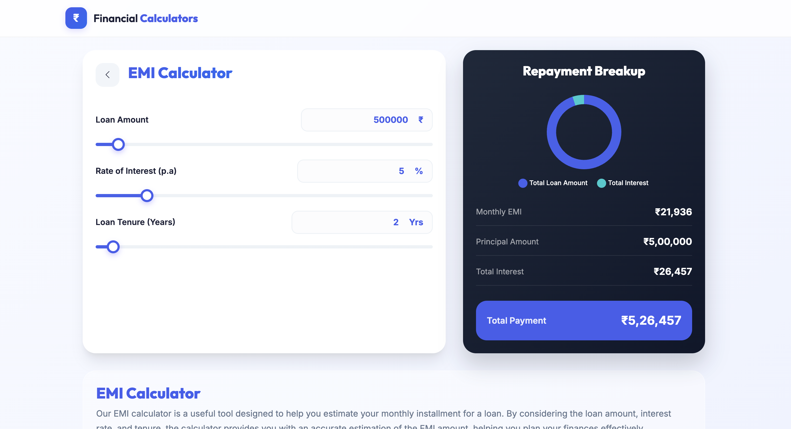
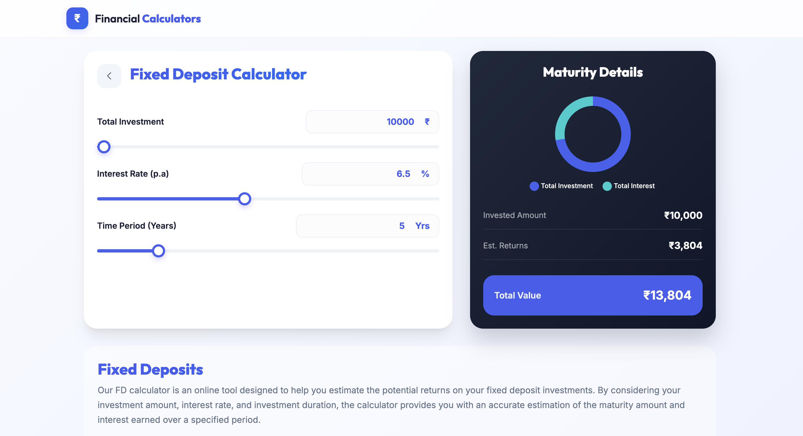
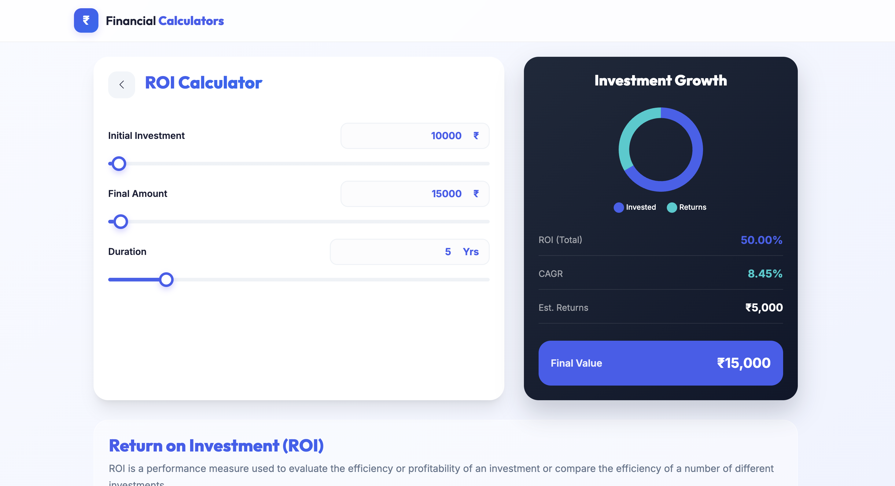

# Financial Calculators

A comprehensive collection of financial calculators built with React, providing easy-to-use tools for various financial calculations.

## 📱 Homepage


## 🧮 Calculator Showcase

### 📊 EMI Calculator
The EMI (Equated Monthly Installment) calculator helps you determine your monthly loan payments.

Features:
- Calculate monthly EMI based on principal, interest rate, and tenure
- View detailed repayment schedule
- Understand total interest payable



### 💰 Fixed Deposit (FD) Calculator
Plan your fixed deposits and calculate returns accurately.

Features:
- Calculate maturity amount for your FD investments
- Compare returns across different tenures
- Account for different interest payout frequencies



### 🏷️ GST Calculator
Calculate Goods and Services Tax easily and accurately.

Features:
- Calculate GST for different tax slabs
- Compute net amount and total tax
- Support for both forward and reverse calculations


### 🏠 HRA Calculator
Calculate your House Rent Allowance tax exemptions.

Features:
- Calculate maximum HRA exemption
- Compare different scenarios
- Consider all relevant factors as per tax laws


### 📈 Interest Calculator
Calculate both Simple and Compound Interest with ease.

Features:
- Toggle between Simple and Compound Interest
- Support for different compounding frequencies
- Visual representation of growth


### 👴 NPS Calculator
Plan your retirement with the National Pension System calculator.

Features:
- Project your retirement corpus
- Understand tax benefits
- Analyze different investment scenarios


### 📗 PPF Calculator
Calculate returns on your Public Provident Fund investments.

Features:
- Long-term investment planning
- Account for annual contributions
- View year-wise accumulated balance


### 💹 ROI Calculator
Measure your Return on Investment accurately.

Features:
- Calculate percentage returns
- Compare different investments
- Account for time periods



### 💲 SIP/Lumpsum Calculator
Plan your mutual fund investments with this comprehensive calculator.

Features:
- Compare SIP vs Lumpsum investments
- Calculate expected returns
- Analyze different investment scenarios


## 🚀 Quick Start

### Prerequisites
- Node.js (v12 or higher)
- npm or yarn

### Installation

1. Clone the repository
```bash
git clone https://github.com/saipraveen446/financial-calculators.git
cd financial-calculators
```

2. Install dependencies
```bash
npm install
```

3. Start the development server
```bash
npm start
```

The application will open in your default browser at `http://localhost:3000`

## 🛠️ Built With

- React.js
- JavaScript (ES6+)
- CSS


## 🌟 Features

- **User-Friendly Interface**: Clean and intuitive design for easy calculations
- **Responsive Design**: Works seamlessly on desktop and mobile devices
- **Real-Time Calculations**: Instant results as you input values
- **Similar Calculator Suggestions**: Recommends related financial tools
- **Modern UI**: Professional and sleek appearance


## 👤 Author

**Sai Praveen**
- GitHub: [@saipraveen446](https://github.com/saipraveen446)
